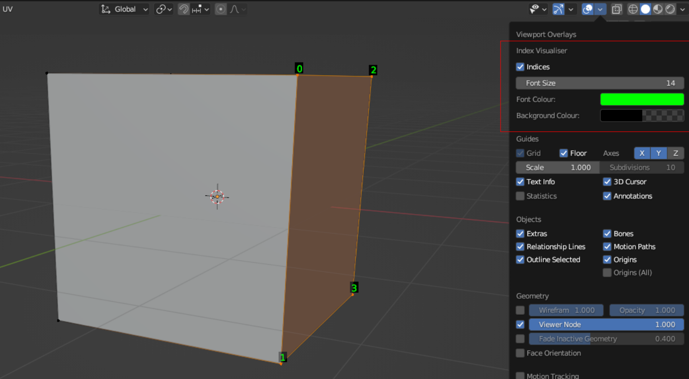

Moved to gitlab

https://gitlab.com/blender_addons_tt/blender-index-visualiser

This repo has also just been updated with the latest version at this time (0.2.2). This will be the last update here.

# Index Visualiser

Show the indices of verts, edges and faces in a readable manner.

There is a similar feature built into blender, but sometimes it's difficult to read the labels. The only control is font colour.

This addon replicates this feature but adds in a background to make it more legible. You can control the font/background colours, and the font size (and of course turn it on/off).

A keyboard shortcut is defined for convenience, this can be changed within blender.

F6 - Toggle labels

Like the inbuilt functionality, the selection mode determines which indices are displayed. The other controls are found in the Overlay menu when in EDIT mode.

If you want to change the defaults then create a new file, change the values and save it as a new startup file (however Indices always defaults to off). Or you can modify `index-visualiser.py`.

## Install

Download the [latest release](https://gitlab.com/blender_addons_tt/blender-index-visualiser/-/releases/permalink/latest), extract it, and use the Install button in Blender's addon preferences.

## Questions/Bugs/Issues/Feature requests etc

If you have any questions or feedback etc, please open an issue.
